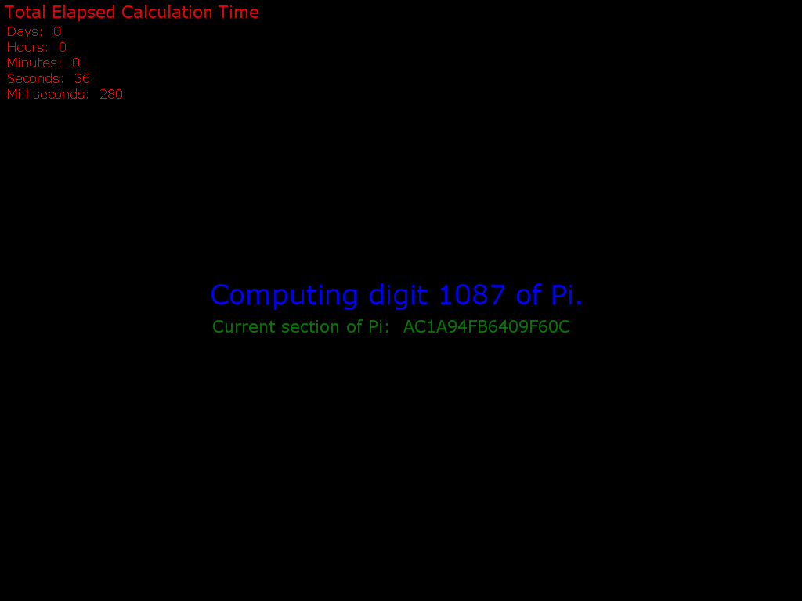
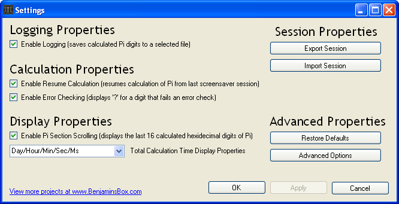
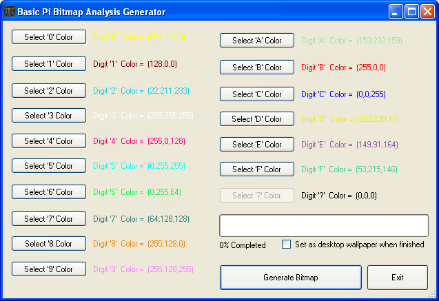

Pi Hex Screensaver
==================
A screensaver that resumes computations of Pi in Hexadecimal with each screensaver session

# Overview
The Pi Hex Screensaver is Windows screensaver that computes Pi in hexadecimal using the BBP algorithm.  The beauty of the BBP formula is that the nth digit of Pi can be calculated fairly rapidly without having to calculate the previous digits up to the nth digit.  Using this algorithm allows the screensaver to resume calculating Pi from where it left off on a previous screensaver session.  A C implementation of David H. Bailey's algorithm was ported to C# to make this program possible.

See David H. Bailey's piqpr8.c implementation at [http://www.experimentalmath.info/bbp-codes/](http://www.experimentalmath.info/bbp-codes/)

David H. Bailey's work on Pi [http://crd.lbl.gov/~dhbailey/pi/](http://crd.lbl.gov/~dhbailey/pi/)

Read more about the [BBP algorithm](./supporting_files/bbp-alg.pdf)

Note: This is some old code I wrote when I was first learning C#, which I am re-releasing today in honor of Pi day (March 14th).

# Features
The Pi Hex Screensaver features:

* dual monitor support
* ability to enable/disable logging of calculated digits
* ability to import/export Pi Hex Screensaver XML sessions
* ability to save a human readable text file containing the calculated digits of Pi
* ability to display the total calculation time of all screensaver sessions in multiple time formats
* ability to enable/disable error checking for calculated digits of Pi
* ability to generate a default Bitmap of the calculated digits of Pi (see screenshots below)
* ability to generate a custom sized Bitmap of the calculated digits of Pi

 
# Installation Instructions
To install the Pi Hex Screensaver:

1. Ensure that your PC has the .Net Framework
2. Download the Pi Hex Screensaver (below)
3. Unzip the Pi Hex Screensaver zip file
4. Copy the Pi Hex Screensaver .scr file in to C:\WINDOWS\system32 or a preferred working directory
5. Right click on the PiHexScreensaver.scr file and click “Install”
6. Download a saved session and import it into the Pi Hex Screensaver (optional - session calculated to 357,134 digits)

To uninstall the Pi Hex Screensaver simply delete the PiHexScreensaver.scr file from the directory that it was installed from.

# Download
You can either download the precompiled screensaver file or download and compile the source yourself using Visual Studio.

Download: [precompiled screensaver file](./PiHexScreensaver/build/PiHexScreensaver.scr)

# Screenshots

## Screensaver

## Settings

## Wallpaper Generator
The screensaver options contain a generator to create a Desktop background using the digits of Pi computed by the screensaver.

## Completed Desktop Wallpaper

After nearly a year running on my personal desktop in 2007, this screensaver finished computing enough digits to complete the 1600x1200 Bitmap desktop background I had designed the screensaver to compute.

Download: [completed session](./supporting_files/Pi-Hex-Screensaver-11-17-07.xml)

Download: [all 1,436,304 calculated digits of Pi in hexadecimal](./supporting_files/Pi-Digits-Output.txt)

